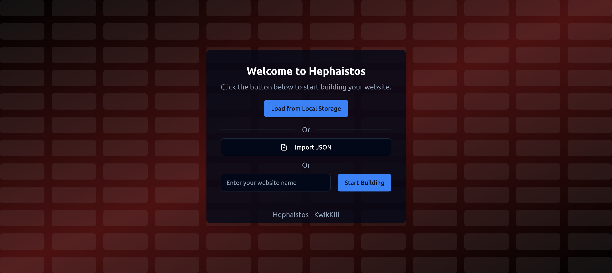
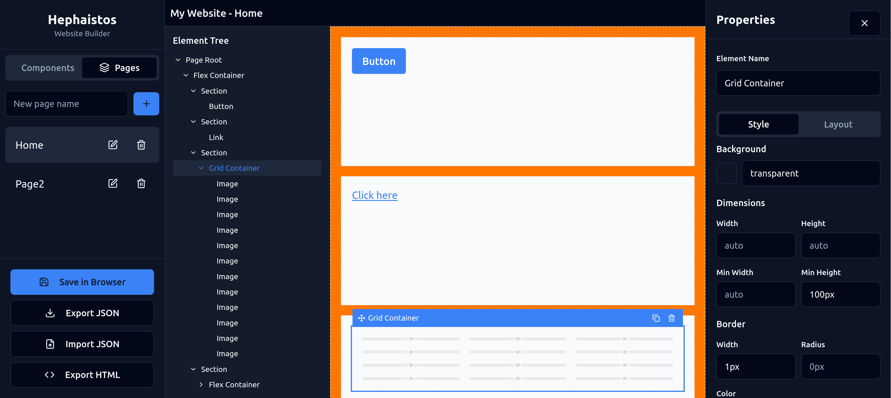
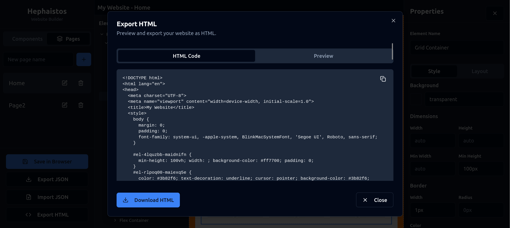

# Hephaistos

Hephaistos is a website builder that allows users to create their own simple websites with ease.
It is built using React and provides a user-friendly interface for creating and customizing web pages.

## Features
- Create and customize web pages using a simple drag-and-drop interface.
- Preview the website in real-time as you build it.
- Visualize the website structure with a tree view.
- Add and edit text, images, and other elements on the page.
- Export the website as a static HTML file for easy deployment.
- Multiple pages support, allowing users to create multi-page websites.
- Save and load projects to continue working on them later.

## Author

This project was created by [KwikKill](https://github.com/KwikKill) as a personal project to learn and practice React. This project is open-source.
